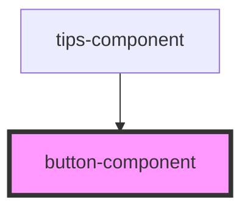

# button-component

<!-- Auto Generated Below -->

## Properties

| Property   | Attribute  | Description                  | Type                                  | Default     |
| ---------- | ---------- | ---------------------------- | ------------------------------------- | ----------- |
| `active`   | `active`   | The active status            | `boolean`                             | `undefined` |
| `bstyle`   | `bstyle`   | The button types             | `"ghost" \| "primary" \| "secondary"` | `'primary'` |
| `disabled` | `disabled` | The disabled status          | `boolean`                             | `undefined` |
| `icon`     | `icon`     | The icon                     | `string`                              | `undefined` |
| `label`    | `label`    | The text label of the button | `string`                              | `'Click'`   |

## Dependencies

### Used by

 - [tips-component](../tips-component)

### Graph

----------------------------------------------

*Built with [StencilJS](https://stenciljs.com/)*
