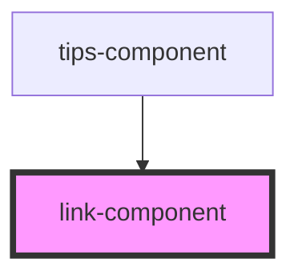

# link-component

<!-- Auto Generated Below -->

## Properties

| Property   | Attribute  | Description                  | Type      | Default     |
| ---------- | ---------- | ---------------------------- | --------- | ----------- |
| `active`   | `active`   | The active status            | `boolean` | `undefined` |
| `disabled` | `disabled` | The disabled status          | `boolean` | `undefined` |
| `icon`     | `icon`     | The icon of the link         | `string`  | `undefined` |
| `label`    | `label`    | The text label of the button | `string`  | `'Link'`    |

## Dependencies

### Used by

 - [tips-component](../tips-component)

### Graph

----------------------------------------------

*Built with [StencilJS](https://stenciljs.com/)*
