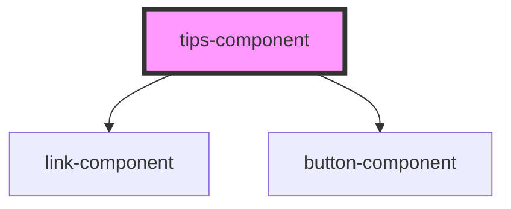

# tutorial-tips

<!-- Auto Generated Below -->

## Properties

| Property      | Attribute      | Description | Type     | Default     |
| ------------- | -------------- | ----------- | -------- | ----------- |
| `acceptLabel` | `accept-label` |             | `string` | `undefined` |
| `actions`     | `actions`      |             | `any`    | `undefined` |
| `backLabel`   | `back-label`   |             | `string` | `undefined` |
| `description` | `description`  |             | `string` | `undefined` |
| `heading`     | `heading`      |             | `string` | `undefined` |
| `position`    | `position`     |             | `string` | `undefined` |
| `subHeading`  | `sub-heading`  |             | `string` | `undefined` |

## Events

| Event    | Description                 | Type               |
| -------- | --------------------------- | ------------------ |
| `accept` |                             | `CustomEvent<any>` |
| `back`   | The back action to redirect | `CustomEvent<any>` |

## Dependencies

### Depends on

- [link-component](../link-component)
- [button-component](../button-component)

### Graph

----------------------------------------------

*Built with [StencilJS](https://stenciljs.com/)*
